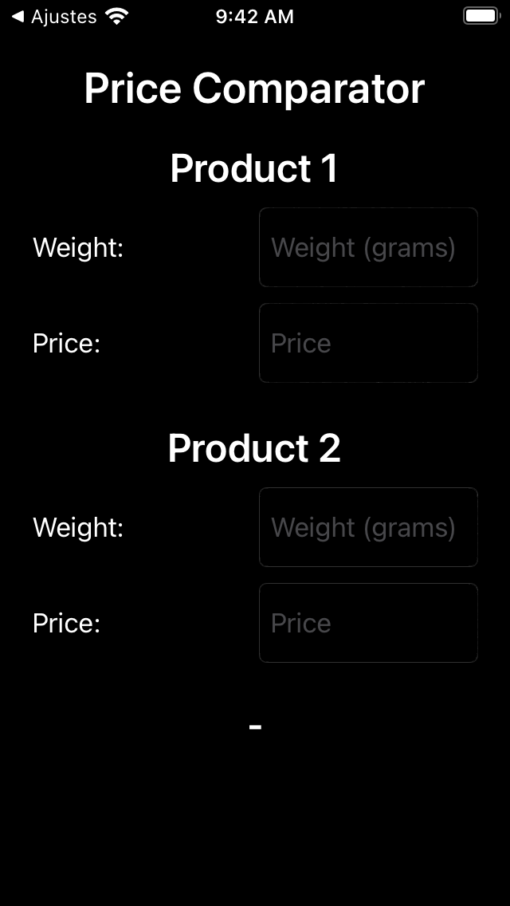
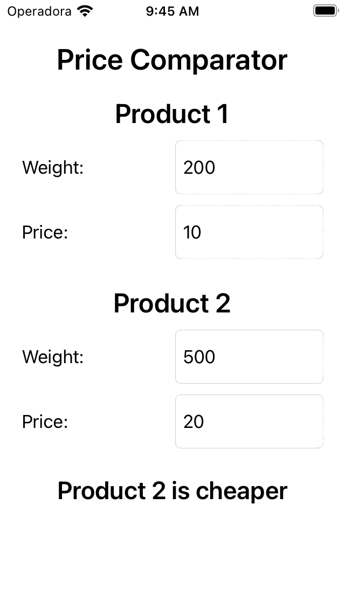
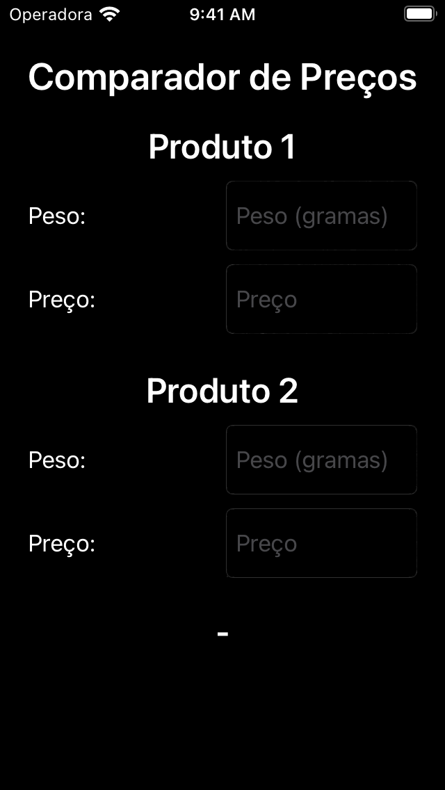

# price-comparator

## The app
This app helps you to know which product is worthwhile buying, comparing the price of the gram of each product.

## Objective
The main objective of this project was to practice:
- MVVM pattern;
- Unit Tests;
- View Code;
- Strings Localization;
- Dark mode support;
- CI.

## Screen Shots

\
\
\
### Texts localized to Portuguese (Brazil)

